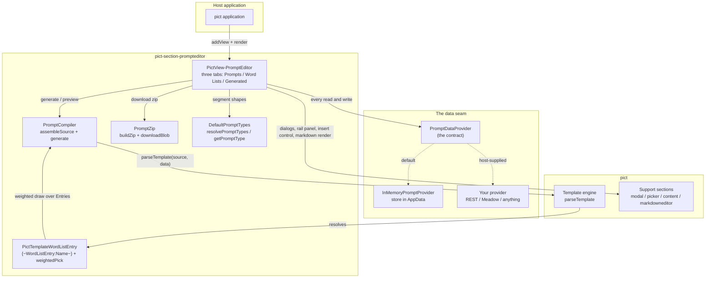

# Architecture

The section is built around one idea: **the prompt you version is not the prompt you send.** A crafted prompt keeps its template expressions intact -- that is the source your team collaborates on. Generation resolves those expressions through the real pict template engine, producing concrete markdown you evaluate, copy, or ship. Keeping the two separate is what makes comparison and iteration possible.

## The pieces

## Generation, step by step

1. **Assemble.** `PromptCompiler.assembleSource(prompt, type)` stitches the prompt's segments into one markdown document: the title heading, then one heading per segment in the type's order. Fixed segments take their body from the type (the locked preamble); empty optional segments are skipped; empty required segments compile with a visible placeholder. Template expressions pass through untouched -- this output is the versionable source.

2. **Resolve.** `PromptCompiler.generate(pict, prompt, type, wordLists)` runs that source through `pict.parseTemplate` with the word lists riding in the parse data as `__PromptEditorWordLists` (a lowercased-name map) plus an optional `__PromptEditorRandom` function. Because it is the real template engine, every pict expression works -- `{~D:Record.Prompt.Title~}` addresses the prompt record itself.

3. **Draw.** Each `{~WordListEntry:Name~}` occurrence resolves independently through `weightedPick`: an entry's chance is its weight over the list's total positive weight. A name that resolves nowhere renders the expression back out literally (so typos are findable), unless a second parameter supplies a miss default: `{~WLE:Name:fallback~}`.

4. **Record.** Each generation is stored through the provider as a `Generated` record with provenance: which prompt, which sequence number. The Generated tab lists them like a file listing -- sequence ascending within a prompt, the most recently generated prompt's group first -- matching the `<slug>-<sequence>.md` names they get in the zip.

## The expression's two resolution paths

The `{~WordListEntry:~}` expression looks for word lists in order:

1. **The parse data** -- a generation run passes exactly the lists it was given (`__PromptEditorWordLists`). This keeps multiple sections on one page exact: each generation resolves against precisely its own lists.
2. **The pict-level resolver registry** -- every mounted section pushes a resolver onto `pict.__PictSectionPromptEditorResolvers`, so the expression also works in ordinary application templates anywhere in the host. Hosts can push their own resolvers without mounting a section.

## State and rendering discipline

- All persistent state lives behind the provider; the in-memory default stores per-instance under `AppData.PromptEditorStores[viewHash]`, so multiple sections coexist on one page.
- The render model is shaped fresh from loaded data into `AppData.PromptEditorActive` before each render; templates iterate it with `{~TS:~}`.
- **Value edits never re-render.** Weight spinners, title fields, and name fields cache to the loaded records, update dependent display (share chips, rail labels) by targeted DOM writes, and persist on a debounce -- a re-render would destroy the input mid-interaction. Structural changes (add/remove row, type switch, tab moves) re-render normally.
- Support views are ensured on first initialize, and the modal view is explicitly initialized so its CSS-variable scope class lands on `<body>` (registering alone leaves dialogs and toasts unstyled).

## The plansheet seams

The section is designed for a host platform to layer team workflows on top without forking it:

- `Meta` on prompts round-trips through the provider untouched -- ratings, version pointers, anything.
- `Author` stamps from the `CurrentUser` option onto prompts and generations.
- Stable `Key`s give comment threads and audit trails something durable to point at.
- Event hooks (`onPromptSaved`, `onWordListSaved`, `onGenerated`, `onChange`, and friends) fire on every mutation.
- Fixed segments keep team-standard preambles versioned with the type definition, not retyped per prompt.
